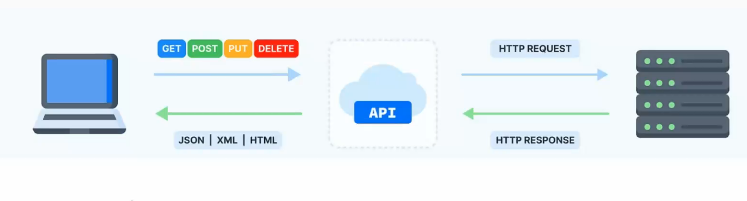
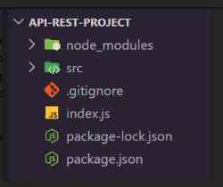

# MODELANDO API REST

### API - aplication programming interface
arquitectura que propone la comunicación utilizando HTTP y JSON.

permite el acceso a información mediante urls únicas.
utiliza métodos GET, POST, PUT, DELETE para interactuar con los recursos.

Caracterísitcas
* sin estado: cada interaccion es independiente, facilita el manejo de múltiples solicitudes.
* formato JSON
* interoperabilidad: permite comunicacion entre sistemas con diferentes tecnologías

REST - Representational estate transfer

### ESTRUCTURA DE ARCHIVOS

Ventajas de la buena organización de archivos:
* organización
* escalablidad
* colaboración

- src
    - routes: las rutas de la api
    - controllers: manejo de solicitudes
    - services: logica de la ruta (acciones q se deben ahcer para responder una solicitud)
    - models: es donde se modelan los datos y donde se interactua con la BBDD

- CAPAS DE LA APLICACIÓN: se refiere a cómo se dividen las responsabilidades
- RUTAS (endspoints): son los puntos que los clientes usan para inteeractuar con la aplicación
- CAPA DE RUTAS: se construyen con la URL y el método HTTP. (Ruta = URL + método)
- CONTROLADORES: manejan las solicitudes, conectan la lógica con las rutas y el resto de la aplicación, además manejan los errores.
- MODELO: describen la estructura de los datos y su interacción con la base de datos (definir propiedades, tipos de datos, validaciones...).
- SERVICIOS: son los motores que realizan las operaciones necesarias para responder las solicitudes (manejan la lógica).

### DIVISIÓN DE RESPONSABILIDADES
1. planificacion estructurada
2. division de responsabilidades: modular la aplicacion, cada capa debe tener un proposito especifico
3. uso de modulos: importar y exportar partes del codigo de forma ordenada, facilita el desarrollo y la prueba de componentes por separado, permite reutilizar el mismo codigo en diferentes partes de la aplicacion y hace más facil adaptar la aplicacion a nuevos requisitos
    - modularidad
    - reutilizacion
    - flexibilidad

